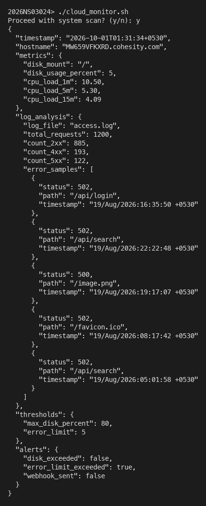
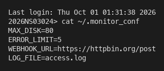
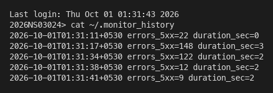
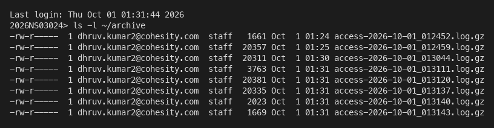
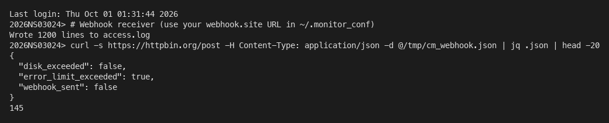

# Cloud Computing EC1 — Assignment 1 Submission

**Student BITS ID (shell prompt):** `2026NS03024`

**Script:** `cloud_monitor.sh` — lightweight telemetry agent that reads system metrics, parses `access.log`, prints JSON, optionally alerts via webhook, audits runs, and archives the log.

---

## 1. JSON data format explanation

The agent prints one JSON object to stdout (valid for ingestion by a central dashboard).

| Field | Meaning |
|--------|---------|
| `timestamp` | ISO-style local time when the scan started |
| `hostname` | Host running the agent |
| `metrics.disk_mount` | Filesystem mount checked (root `/`) |
| `metrics.disk_usage_percent` | Used space % from `df -P` |
| `metrics.cpu_load_1m`, `cpu_load_5m`, `cpu_load_15m` | Load averages (from `/proc/loadavg` or `sysctl vm.loadavg` on macOS) |
| `log_analysis.log_file` | Configured log file name |
| `log_analysis.total_requests` | Lines with a valid HTTP status |
| `log_analysis.count_2xx`, `count_4xx`, `count_5xx` | Status class counts |
| `log_analysis.error_samples` | Up to five sample 5xx entries (status, path, timestamp) |
| `thresholds.max_disk_percent`, `error_limit` | Values from `~/.monitor_conf` |
| `alerts.disk_exceeded` | True if disk usage ≥ `MAX_DISK` |
| `alerts.error_limit_exceeded` | True if 5xx count > `ERROR_LIMIT` |
| `alerts.webhook_sent` | True if `curl` POST to `WEBHOOK_URL` succeeded when an alert fired |

**Alert rule:** Webhook POST runs when `disk_exceeded` or `error_limit_exceeded` is true.

**Config file (`~/.monitor_conf`):** `MAX_DISK`, `ERROR_LIMIT`, `WEBHOOK_URL`, `LOG_FILE` (see `monitor_conf.sample`). Use your personal [webhook.site](https://webhook.site) URL in `WEBHOOK_URL` for the graded demo; corporate networks may block that host—open webhook.site on an allowed network, paste the URL into config, and capture a browser screenshot of the received payload.

---

## 2. Proof screenshots (rubric mapping)

### Core: JSON + guardrail (8 + 2 marks)



*Shows customized BITS ID prompt, `y/n` confirmation, and formatted JSON output.*

### Add-on #2: Configuration file



*`~/.monitor_conf` with dynamic thresholds (not hardcoded in the script).*

### Add-on #3: Audit logging



*`~/.monitor_history` entries: timestamp, 5xx count, execution duration.*

### Add-on #4: Log archival



*Compressed logs in `~/archive/access-YYYY-MM-DD_HHMMSS.log.gz` after analysis.*

### Add-on #1: Webhook alerting



*HTTP POST of the JSON when 5xx count exceeds `ERROR_LIMIT`. Screenshot uses `https://httpbin.org/post` as receiver where webhook.site is blocked; substitute your webhook.site URL for submission per assignment.*

---

## 3. Complete source code — `cloud_monitor.sh`

```bash
#!/usr/bin/env bash
# cloud_monitor.sh — BITS WILP Cloud Computing EC1 telemetry agent
set -u

SCRIPT_DIR="$(cd "$(dirname "${BASH_SOURCE[0]}")" && pwd)"
CONF_FILE="${HOME}/.monitor_conf"
HISTORY_FILE="${HOME}/.monitor_history"
ARCHIVE_DIR="${HOME}/archive"

MAX_DISK=""
ERROR_LIMIT=""
WEBHOOK_URL=""
LOG_FILE=""

die() {
  echo "error: $*" >&2
  exit 1
}

require_cmd() {
  command -v "$1" >/dev/null 2>&1 || die "required command not found: $1"
}

load_config() {
  [[ -f "$CONF_FILE" ]] || die "missing config $CONF_FILE (see monitor_conf.sample)"
  while IFS= read -r line || [[ -n "$line" ]]; do
    line="${line%%#*}"
    line="$(echo "$line" | sed 's/^[[:space:]]*//;s/[[:space:]]*$//')"
    [[ -z "$line" ]] && continue
    [[ "$line" != *=* ]] && die "invalid config line (expected KEY=VALUE): $line"
    key="${line%%=*}"
    val="${line#*=}"
    key="$(echo "$key" | sed 's/[[:space:]]//g')"
    val="$(echo "$val" | sed 's/^[[:space:]]*//;s/[[:space:]]*$//')"
    case "$key" in
      MAX_DISK) MAX_DISK="$val" ;;
      ERROR_LIMIT) ERROR_LIMIT="$val" ;;
      WEBHOOK_URL) WEBHOOK_URL="$val" ;;
      LOG_FILE) LOG_FILE="$val" ;;
      *) die "unknown config key: $key" ;;
    esac
  done <"$CONF_FILE"

  [[ -n "$MAX_DISK" ]] || die "MAX_DISK not set in $CONF_FILE"
  [[ -n "$ERROR_LIMIT" ]] || die "ERROR_LIMIT not set in $CONF_FILE"
  [[ -n "$WEBHOOK_URL" ]] || die "WEBHOOK_URL not set in $CONF_FILE"
  [[ -n "$LOG_FILE" ]] || die "LOG_FILE not set in $CONF_FILE"

  [[ "$MAX_DISK" =~ ^[0-9]+$ ]] || die "MAX_DISK must be an integer percent"
  [[ "$ERROR_LIMIT" =~ ^[0-9]+$ ]] || die "ERROR_LIMIT must be a non-negative integer"
}

resolve_log_path() {
  if [[ "$LOG_FILE" = /* ]]; then
    LOG_PATH="$LOG_FILE"
  else
    LOG_PATH="${SCRIPT_DIR}/${LOG_FILE}"
  fi
}

get_disk_usage() {
  local mount="/"
  local line pct
  line="$(df -P "$mount" 2>/dev/null | awk 'NR==2 {print}')"
  [[ -n "$line" ]] || die "df failed for $mount"
  pct="$(echo "$line" | awk '{gsub(/%/,"",$5); print $5}')"
  DISK_MOUNT="$mount"
  DISK_PCT="$pct"
}

get_load_averages() {
  if [[ -r /proc/loadavg ]]; then
    read -r LOAD_1 LOAD_5 LOAD_15 _rest < /proc/loadavg
  else
    local raw
    raw="$(sysctl -n vm.loadavg 2>/dev/null || true)"
    raw="$(echo "$raw" | tr -d '{}')"
    LOAD_1="$(echo "$raw" | awk '{print $1}')"
    LOAD_5="$(echo "$raw" | awk '{print $2}')"
    LOAD_15="$(echo "$raw" | awk '{print $3}')"
  fi
  [[ -n "$LOAD_1" ]] || die "could not read CPU load averages"
}

parse_access_log() {
  local f="$LOG_PATH"
  local stats_file samples_file
  stats_file="$(mktemp)"
  samples_file="$(mktemp)"

  awk -v samples_path="$samples_file" '
    function extract_ts(line,    t) {
      if (match(line, /\[/)) {
        start = RSTART + 1
        end = index(substr(line, start), "]")
        if (end > 0) return substr(line, start, end - 1)
      }
      return ""
    }
    function extract_path(line,    p) {
      if (match(line, /"[A-Z]+ /)) {
        start = RSTART + 1
        rest = substr(line, start)
        sub(/ HTTP.*/, "", rest)
        sub(/^[^ ]+ /, "", rest)
        return rest
      }
      return ""
    }
    BEGIN { t2 = 0; t4 = 0; t5 = 0; total = 0; samples = 0 }
    {
      st = $(NF - 1)
      if (st !~ /^[0-9][0-9][0-9]$/) next
      total++
      if (st >= 200 && st < 300) t2++
      else if (st >= 400 && st < 500) t4++
      else if (st >= 500 && st < 600) {
        t5++
        if (samples < 5) {
          ts = extract_ts($0)
          path = extract_path($0)
          gsub(/"/, "\\\"", path)
          gsub(/"/, "\\\"", ts)
          printf "{\"status\":%s,\"path\":\"%s\",\"timestamp\":\"%s\"}\n", st, path, ts >> samples_path
          samples++
        }
      }
    }
    END {
      printf "%d %d %d %d\n", total, t2, t4, t5
    }
  ' "$f" >"$stats_file"

  read -r TOTAL_REQUESTS COUNT_2XX COUNT_4XX COUNT_5XX <"$stats_file"
  if [[ -s "$samples_file" ]]; then
    ERROR_SAMPLES_JSON="$(jq -s '.' "$samples_file")"
  else
    ERROR_SAMPLES_JSON="[]"
  fi
  rm -f "$stats_file" "$samples_file"
}

build_json() {
  local disk_exceeded_json error_exceeded_json
  disk_exceeded_json=false
  error_exceeded_json=false

  if ((DISK_PCT >= MAX_DISK)); then disk_exceeded_json=true; fi
  if ((COUNT_5XX > ERROR_LIMIT)); then error_exceeded_json=true; fi

  JSON_REPORT="$(jq -n \
    --arg timestamp "$REPORT_TS" \
    --arg hostname "$HOSTNAME_VAL" \
    --arg disk_mount "$DISK_MOUNT" \
    --argjson disk_usage_percent "$DISK_PCT" \
    --argjson cpu_load_1m "$LOAD_1" \
    --argjson cpu_load_5m "$LOAD_5" \
    --argjson cpu_load_15m "$LOAD_15" \
    --arg log_file "$LOG_FILE" \
    --argjson total_requests "$TOTAL_REQUESTS" \
    --argjson count_2xx "$COUNT_2XX" \
    --argjson count_4xx "$COUNT_4XX" \
    --argjson count_5xx "$COUNT_5XX" \
    --argjson error_samples "$ERROR_SAMPLES_JSON" \
    --argjson max_disk_percent "$MAX_DISK" \
    --argjson error_limit "$ERROR_LIMIT" \
    --argjson disk_exceeded "$disk_exceeded_json" \
    --argjson error_limit_exceeded "$error_exceeded_json" \
    --argjson webhook_sent false \
    '{
      timestamp: $timestamp,
      hostname: $hostname,
      metrics: {
        disk_mount: $disk_mount,
        disk_usage_percent: $disk_usage_percent,
        cpu_load_1m: $cpu_load_1m,
        cpu_load_5m: $cpu_load_5m,
        cpu_load_15m: $cpu_load_15m
      },
      log_analysis: {
        log_file: $log_file,
        total_requests: $total_requests,
        count_2xx: $count_2xx,
        count_4xx: $count_4xx,
        count_5xx: $count_5xx,
        error_samples: $error_samples
      },
      thresholds: {
        max_disk_percent: $max_disk_percent,
        error_limit: $error_limit
      },
      alerts: {
        disk_exceeded: $disk_exceeded,
        error_limit_exceeded: $error_limit_exceeded,
        webhook_sent: $webhook_sent
      }
    }')"
}

send_webhook_if_needed() {
  local disk_exceeded error_exceeded
  disk_exceeded=false
  error_exceeded=false
  if ((DISK_PCT >= MAX_DISK)); then disk_exceeded=true; fi
  if ((COUNT_5XX > ERROR_LIMIT)); then error_exceeded=true; fi

  WEBHOOK_SENT=false
  if [[ "$disk_exceeded" == true || "$error_exceeded" == true ]]; then
    if curl -sS -X POST "$WEBHOOK_URL" \
      -H "Content-Type: application/json" \
      -d "$JSON_REPORT" >/dev/null 2>&1; then
      WEBHOOK_SENT=true
    fi
  fi

  JSON_REPORT="$(echo "$JSON_REPORT" | jq --argjson webhook_sent "$WEBHOOK_SENT" '.alerts.webhook_sent = $webhook_sent')"
}

append_history() {
  local duration="$1"
  printf '%s errors_5xx=%s duration_sec=%s\n' "$REPORT_TS" "$COUNT_5XX" "$duration" >>"$HISTORY_FILE"
}

rotate_log() {
  mkdir -p "$ARCHIVE_DIR"
  local stamp archived
  stamp="$(date '+%Y-%m-%d_%H%M%S')"
  archived="${ARCHIVE_DIR}/access-${stamp}.log.gz"
  gzip -c "$LOG_PATH" >"$archived"
  rm -f "$LOG_PATH"
}

main() {
  require_cmd awk
  require_cmd df
  require_cmd jq
  require_cmd curl
  require_cmd gzip
  require_cmd sed

  load_config
  resolve_log_path

  read -r -p "Proceed with system scan? (y/n): " confirm
  confirm="$(echo "$confirm" | tr '[:upper:]' '[:lower:]')"
  case "$confirm" in
    y|yes) ;;
    n|no)
      echo "Scan cancelled."
      exit 0
      ;;
    *)
      die "invalid response; expected y or n"
      ;;
  esac

  [[ -f "$LOG_PATH" ]] || die "log file not found: $LOG_PATH"

  START_EPOCH="$(date +%s)"
  REPORT_TS="$(date '+%Y-%m-%dT%H:%M:%S%z')"
  HOSTNAME_VAL="$(hostname 2>/dev/null || echo unknown)"

  get_disk_usage
  get_load_averages
  parse_access_log
  build_json

  echo "$JSON_REPORT"

  send_webhook_if_needed
  END_EPOCH="$(date +%s)"
  DURATION="$((END_EPOCH - START_EPOCH))"
  append_history "$DURATION"
  rotate_log
}

main "$@"
```

---

## 4. How to reproduce locally

```bash
cp monitor_conf.sample ~/.monitor_conf   # set WEBHOOK_URL to your webhook.site link
./generate_access_log.sh access.log 1200
export PS1='YourBITSID> '
./cloud_monitor.sh
```

Re-generate proof images: `./capture_screenshots.sh` (after editing `bits_env.sh`).

Export this file to PDF or Word for portal upload if required.
